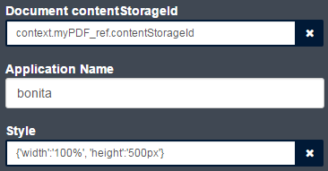
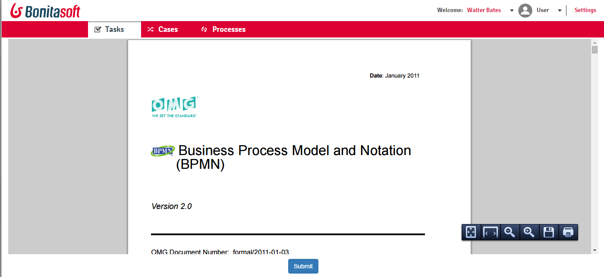

# PDF viewer widget
Bonita BPM 7 widget displaying a Bonita document as a PDF.<br/>
Current widget version (v1.0) is compatible with Bonita BPM 7.1 and upper.

## Resources
The release zip contains two files:
* ```widget-pdfViewer.zip``` - the widget itself
* ```Display PDF-1.0.bos``` - a sample process using the widget (importing it will automatically import the widget)

## Configuration
Widget properties:
* ```Document contentStorageId``` - the contentStorageId of your Bonita document. Can be retrieved using the context. Be sure to activate binding for this property.
* ```Application Name``` - the web application name (bonita by default).
* ```Style``` - the CSS style used for the PDF viewer passed as a JS object. Make sure to activate binding for this property.

## Screenshots
Configuration used in the sample process:<br/>
<p align="center"></p>

Widget rendered in form:<br/>
<p align="center"></p>
